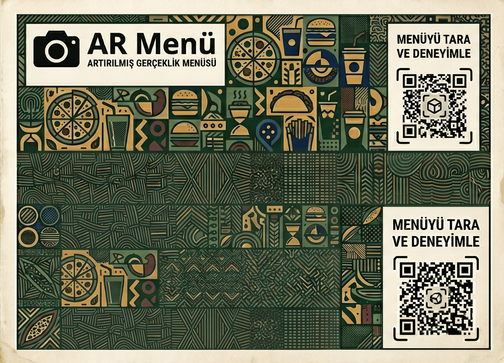

# 🍽️ WebAR Dijital Restoran Menüsü

Müşterilerin restoran menüsünü 3D modellerle (GLB formatında) kendi masalarında interaktif olarak inceleyebildiği, A-Frame ve MindAR tabanlı artırılmış gerçeklik (AR) web uygulaması.

## ✨ Özellikler
* **Artırılmış Gerçeklik (AR):** Özel menü kağıdı (marker) okutularak yemeklerin 3D modellerinin fiziksel ortamda görüntülenmesi.
* **Geniş 3D Menü Yelpazesi:** Gözleme, baklava, burger, ayran ve daha birçok ürünün yüksek detaylı .glb formatındaki modelleri.
* **Uygulamasız Kullanım:** Herhangi bir mobil uygulama indirmeye gerek kalmadan, doğrudan web tarayıcısı üzerinden kamera erişimiyle çalışma.

## 📸 Nasıl Test Edilir?
Bu AR deneyimini yaşamak için kameranızın hedef alacağı bir referans görseline (menü kağıdına) ihtiyacınız var.

1. Bilgisayarınızdan veya telefonunuzdan siteyi açın.
2. Tarayıcının kamera erişim iznini onaylayın.
3. Telefonunuzun kamerasını, aşağıdaki **Menü Kağıdı** görseline (veya çıktı aldıysanız fiziksel kağıda) doğru tutun.
4. 3D yemek modellerinin menü üzerinde belirmesini izleyin!

## 🛠️ Kullanılan Teknolojiler
* **Frontend:** HTML, JavaScript
* **AR & 3D Altyapısı:** A-Frame, MindAR
* **3D Modeller:** .glb formatında optimize edilmiş varlıklar

## 🚀 Yerelde Çalıştırma
Projeyi kendi bilgisayarınızda test etmek isterseniz:
1. Depoyu bilgisayarınıza klonlayın.
2. Web kamerası erişimi gerektirdiği için dosyaları doğrudan açmak yerine bir yerel sunucu (Localhost) kullanın (Örn: VS Code Live Server eklentisi).
3. `index.html` dosyasını çalıştırın ve kameranızı menü kağıdına yöneltin.
